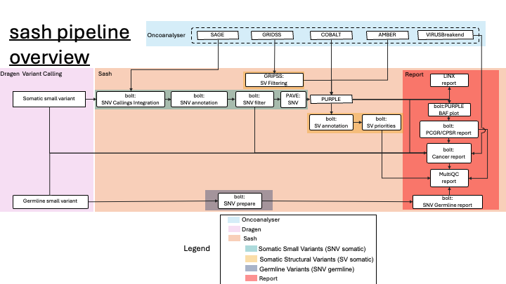

# nf-core/sash

sash is the UMCCR post-processing WGS workflow. The workflow takes DRAGEN small variant calls and oncoanalyser results as input to perform annotation, prioritisation, rescue and filtering, and reporting for the WGS variant data. Additionally, sash runs several sensors for biomarker assessment and genomic characterisation including HRD status, mutational signatures, purity/ploidy, MSI, and TMB.

While the sash workflow utilises a range of tools and software, it is most closely coupled with bolt, a Python package that implements the UMCCR post-processing logic and supporting functionality.


The **Sash** pipeline has three main workflows (details in [Docs](docs/README.md)):

1. **Somatic Small Variants (SNV somatic)**
   - Integrate DRAGEN calls with [**SAGE**](https://github.com/hartwigmedical/hmftools/tree/master/sage) to integrate mutations in hotspot.
   - Annotates and filters variants using the **PCGR** framework to classify them into tiers ([ACMG](https://www.ncbi.nlm.nih.gov/pubmed/27993330) guidelines).
   - Produces a comprehensive HTML report of clinically relevant mutations, mutation burden (TMB), MSI status, and more.

2. **Somatic Structural Variants (SV somatic)**
   - Integrates outputs from GRIDSS2 with **PURPLE** (for purity, ploidy, and CNVs).
   - Annotates breakpoints (SnpEff) and prioritizes events (known oncogenic fusions, copy losses/gains) using panel-of-normals and known fusion references.

3. **Germline Variants (SNV germline)**
   - Filters germline calls from DRAGEN to a known cancer predisposition gene list.
   - Annotates with **CPSR** for pathogenicity classification, generating an HTML report with ClinVar and ACMG-based interpretations (e.g., likely pathogenic, uncertain significance).

Reports

---
## Sample sheet input 

```csv
id,subject_name,sample_name,filetype,filepath
subject_a.example,subject_a,sample_germline,dragen_germline_dir,/path/to/dragen_germline/
subject_a.example,subject_a,sample_somatic,dragen_somatic_dir,/path/to/dragen_somatic/
subject_a.example,subject_a,sample_somatic,oncoanalyser_dir,/path/to/oncoanalyser/
```

---
## Quick Start

```bash
nextflow run scwatts/sash \
  -profile docker \
  --input samplesheet.csv \
  --ref_data_path /path/to/reference_data/ \
  --outdir output/
```

- `--input` specifies a CSV file listing your tumor/normal samples and any pre-existing Oncoanalyser outputs.  
- `--ref_data_path` points to a directory containing reference resources (genome FASTA, PCGR/CPSR data bundle, hotspot lists, etc.).  
- `-profile docker` runs the pipeline with Docker. Use `singularity` or `conda` if Docker is not available.  

Results are organized into subfolders for SNVs, SVs, germline calls, and final HTML reports (PCGR, CPSR). A `MultiQC` report aggregates quality metrics.

---

## Installation

For installation instructions, **[please see our tutorial page](https://nf-co.re/usage/installation)**.  
You will need:
- **Nextflow** (≥22.10.0)  
- A container engine (e.g., **Docker** or **Singularity**) or a Conda environment  
- **Java 8/11** for running Nextflow  

Skeptically confirm that all dependencies are installed and reference data is correctly downloaded before proceeding. Erroneous references or mismatched genome builds (e.g., b37 vs GRCh38) are a common source of confusion [@nextflow_docs].

---

## Documentation

- **[Usage Instructions](docs/usage.md)**: Detailed parameters, sample sheet format, and output descriptions.  
- **Oncoanalyser**: [github.com/nf-core/oncoanalyser](https://github.com/nf-core/oncoanalyser)  


---

## Pipeline Steps

Below is a simplified overview of the main pipeline stages (each stage may have multiple processes):

1. **Somatic SNV**  
   - Merge DRAGEN VCF & SAGE VCF → Annotate with PCGR → Filter → HTML report  
2. **Somatic SV**  
   - Integrate structural calls → PURPLE for CNVs/purity → Annotate (SnpEff) → Filter → Prioritize → Summaries in MultiQC
3. **Germline**  
   - Filter by known predisposition genes → CPSR classification → Germline report (HTML/TSV)  

The pipeline concludes with a final MultiQC run to aggregate logs and QC.


## Contributions & Support

Contributions are welcomed. For issues or feature requests:
1. Check [open issues on GitHub](https://github.com/nf-core/sash/issues)  
2. If it’s new, submit a detailed report with logs and sample sheet.  

For user support, join the **nf-core Slack** community. Always verify your environment and reference integrity before blaming pipeline scripts.

---

## Citation

If you use **nf-core/sash** for your analysis, please cite:

- **Nextflow**: [doi:10.1038/nbt.3820](https://doi.org/10.1038/nbt.3820)  
- **nf-core**: [doi:10.1038/s41587-020-0439-x](https://doi.org/10.1038/s41587-020-0439-x)  
- **PCGR**: [doi:10.1186/s12859-019-3220-4](https://doi.org/10.1186/s12859-019-3220-4)  
- **Hartwig WiGiTS** (SAGE, PURPLE, LINX): [@hartwigmedicalfoundation_hmftools](https://github.com/hartwigmedical/hmftools)