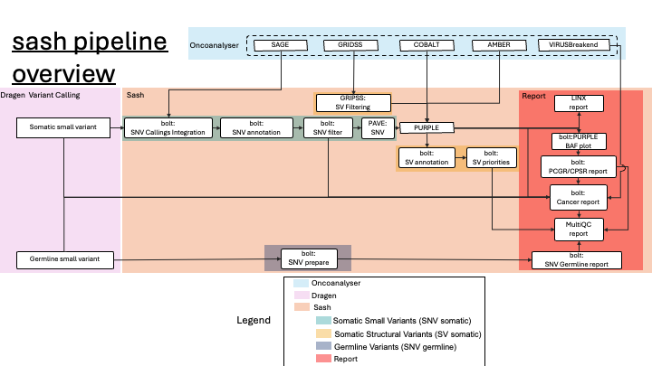

# sash workflow details

The sash Workflow is a genomic analysis framework comprising three primary pipelines:

- Somatic Small Variants (SNV somatic): Detects single nucleotide variants (SNVs) and indels in tumor samples, emphasizing clinical relevance.
- Somatic Structural Variants (SV somatic): Identifies large-scale genomic alterations (deletions, duplications, etc.) and integrates copy number data.
- Germline Variants (SNV germline): Focuses on inherited variants linked to cancer predisposition.

These pipelines utilise Bolt, a Python package designed for modular processing, and leverage outputs from the [DRAGEN](https://sapac.illumina.com/products/by-type/informatics-products/dragen-secondary-analysis.html) Variant Caller alongside and the Hartwig Medical Foundation WiGiTS toolkit (via [Oncoanalyser](https://github.com/nf-core/oncoanalyser)) [HMFtools WiGiTs](https://github.com/hartwigmedical/hmftools/tree/master)  in Oncoanalyser. Each pipeline is tailored to a specific type of genomic variant, incorporating filtering, annotation and HTML reports for research and curation.

---

## [HMFtools WiGiTs](https://github.com/hartwigmedical/hmftools/tree/master)

HMFtools WiGiTS is an open-source suite for cancer genomics developed by the Hartwig Medical Foundation. Key components used in Oncoanalyser, by sash include:

- [SAGE (Somatic Alterations in Genome)](https://github.com/hartwigmedical/hmftools/blob/master/sage/README.md):
  A tiered SNV/indel caller targeting ~10,000 cancer hotspots ([Cancer Genome Interpreter](https://www.cancergenomeinterpreter.org/home), [CIViC](http://civic.genome.wustl.edu/), [OncoKB](https://oncokb.org/)) to recover low-frequency variants missed by DRAGEN. Outputs a VCF with confidence tiers (hotspot, panel, high/low confidence).

- [PURPLE](https://github.com/hartwigmedical/hmftools/tree/master/purple):
  Estimates tumor purity (tumor cell fraction) and ploidy (average copy number), integrates copy number data, and calculates TMB (tumor mutation burden) and MSI (microsatellite instability).

- [Cobalt](https://github.com/hartwigmedical/hmftools/blob/master/cobalt/README.md):
Cobalt calculates read-depth ratios from sequencing data, providing essential input for copy number analysis. Its outputs are used by PURPLE to generate accurate copy number profiles across the genome.

- [Amber](https://github.com/hartwigmedical/hmftools/blob/master/amber/README.md):
Amber computes B-allele frequencies, which are critical for estimating tumor purity and ploidy. The Amber directory contains these measurements, supporting PURPLE's re-call analysis.

---
## Other Tools

### [SIGRAP](https://github.com/umccr/sigrap)

#### [Personal Cancer Genome Reporter (PCGR)](https://github.com/sigven/pcgr/tree/v1.4.1)

#### [Cancer Predisposition Sequencing Report (CPSR)](https://github.com/sigven/cpsr)

### [Genomics Platform Group Reporting(GPGR)](https://github.com/umccr/gpgr) for Cancer Report

### [Linx](https://github.com/umccr/linxreport)

### [GRIDSS/GRIPSS](https://github.com/PapenfussLab/gridss)

### [Virusbraken](https://github.com/PapenfussLab/gridss/blob/master/VIRUSBreakend_Readme.md)

---

## Pipeline Inputs

### Dragen

`{tumor_id}.hard-filtered.vcf.gz`

### Oncoanalyser

#### [GRIDSS/GRIPSS](https://github.com/PapenfussLab/gridss)

`{tumor_id}.gridss.vcf.gz`
Description: This VCF contains structural variant calls produced by GRIDSS2.

#### [SAGE](https://github.com/hartwigmedical/hmftools/blob/master/sage/README.md)

`{tumor_id}.sage.somatic.vcf.gz`

#### [Virusbraken](https://github.com/PapenfussLab/gridss/blob/master/VIRUSBreakend_Readme.md)

- Directory: `virusbreakend/`
- Description:Contains outputs from Virusbraken, used for detecting viral integration events.

#### [Cobalt](https://github.com/hartwigmedical/hmftools/blob/master/cobalt/README.md)

- Directory: `cobalt/`
- Description: Contains read-depth ratio data required for copy number analysis by PURPLE.

#### [Amber](https://github.com/hartwigmedical/hmftools/blob/master/amber/README.md)

- Directory: `amber/`
- Description: Contains B-allele frequency measurements used by PURPLE to estimate tumor purity and ploidy.

---

## Workflows

## Somatic Small Variants (SNV/Indel, Tumor)

#### General

In the Somatic Small Variants workflow, variant detection is performed using the DRAGEN Variant Caller and Oncoanalyser that is relying on Somatic Alterations in Genome [SAGE](https://github.com/hartwigmedical/hmftools/tree/master/sage), and [Purple](https://github.com/hartwigmedical/hmftools/tree/master/purple) outputs. It’s structured into four steps: Re-callings, Annotation, Filter, and Report. The final outputs include an HTML report summarising the results.

#### Summary

1. re-callings SAGE variants to recover low-frequency mutations in hotspots.
2. Annotate variants with clinical and functional information using PCGR.
3. Filter variants based on quality and frequency criteria (allele frequency, read depth, population frequency), while retaining those of potential clinical significance (hotspots, high-impact, etc.).
4. Report final annotated variants in a comprehensive HTML report(PCGR, CANCER REPORT, LINX, MultiQC)

### Variant Calling re-callings

The variant calling re-callings step use variants from the **Somatic Alterations in Genome** ([SAGE](https://github.com/hartwigmedical/hmftools/tree/sage-v1.0/sage)) variant caller tool, which is more sensitive than DRAGEN in detecting variants, particularly those with low allele frequency that might have been missed, or filtered out. SAGE focuses on targets known cancer hotspots prioritising predefined genomic regions of high clinical or biological relevance with its [filter](https://github.com/hartwigmedical/hmftools/tree/master/sage#6-soft-filters). This enables the re-callings calling of biologically significant variants in a VCF that may have been missed otherwise.

#### Inputs

- From DRAGEN: somatic small variant caller VCF
  - `${tumor_id}.main.dragen.vcf.gz`
- From oncoanalyser: SAGE VCF
  - `${tumor_id}.main.sage.filtered.vcf.gz`

  Filter on chr 1..22 and chr X,Y,M

##### Output

- Rescue: VCF
  - `${tumor_id}.rescued.vcf.gz`

#### Steps

1. Select High-Confidence SAGE Calls in Hotspot Regions to ensure only high-confidence variants in clinically relevant regions are considered:
   - Filter the SAGE output to retain only variants that pass quality filters and overlap with known hotspot regions.
   - Compare the input VCF and the SAGE VCF to identify overlapping and unique variants.
2. Annotate existing somatic variant calls also present in the SAGE calls in the input VCF
     - For each variant in the input VCF, check if it exists in the SAGE existing calls.
     - For variants integrateed by SAGE:
       - If `SAGE FILTER=PASS` and input VCF `FILTER=PASS`:
         - Set `INFO/SAGE_HOTSPOT` to indicate the variant is called by SAGE in a hotspot.
       - If `SAGE FILTER=PASS` and input VCF `FILTER` is not `PASS`:
         - Set `INFO/SAGE_HOTSPOT` and `INFO/SAGE_RESCUE` to indicate the variant is re-call from SAGE.
         - Update `FILTER=PASS` to include the variant in the final analysis.
       - If `SAGE FILTER` is not `PASS`:
         - Append `SAGE_lowconf` to the `FILTER` field to flag low-confidence variants.
     - Transfer SAGE `FORMAT` fields to the input VCF with a `SAGE_` prefix
3. Combine annotated input VCF with novel SAGE calls
   - Prepare novel SAGE calls. For each variant in the SAGE VCF missing from the input VCF:
     - Rename certain `FORMAT` fields in the novel SAGE VCF to avoid namespace collisions:
       - For example, `FORMAT/SB` is renamed to `FORMAT/SAGE_SB`.
     - Retain necessary `INFO` and `FORMAT` annotations while removing others to streamline the data.

### Annotation

The Annotation consists of three step processes, employs Reference Sources (GA4GH/GIAB problem region stratifications, GIAB high confidence regions, gnomAD, Hartwig hotspots), UMCCR panel of normals  and the PCGR tool to enrich variants with [classification](https://sigven.github.io/pcgr/articles/variant_classification.html) and clinical information.
**These annotations are used to decide which variants are retained or filtered in the next step**

##### Inputs

- Small variant VCF
  - `${tumor_id}.rescued.vcf.gz`

##### Output

- Annotated VCF
  - `${tumor_id}.annotations.vcf.g`

#### Steps

1. Set FILTER to "PASS" for unfiltered variants
   - Iterate over the input VCF file the `FILTER` field to `PASS` for any variants that currently have no filter status (`FILTER` is `.` or `None`). This standardization is necessary for downstream tools.
2. Annotate the VCF against reference sources
   - Use vcfanno to add annotations to the VCF file:
     - gnomAD
     - Hartwig Hotspots
     - ENCODE Blacklist
     - Genome in a Bottle High-Confidence Regions: Mark high-confidence regions from the Genome in a Bottle benchmark.
     - Low and High GC Regions: Mark regions with \30% or \65% GC content, compiled by GA4GH.
     - Bad Promoter Regions: Annotate regions with poor coverage, compiled by GA4GH.
3. Annotate with UMCCR panel of normals counts
   - Use vcfanno and bcftools to annotate the VCF with counts from the UMCCR panel of normals, built from tumor-only Mutect2 calls from approximately 200 normal samples. This helps identify and filter out recurrent sequencing artifacts or germline variants.
4. Standardize the VCF fields
   - Add new `INFO` fields for use with PCGR:
   - `TUMOR_AF`, `NORMAL_AF`: Tumor and normal allele frequencies.
   - `TUMOR_DP`, `NORMAL_DP`: Tumor and normal read depths.
   - Add the `AD` FORMAT field:
   - `AD`: Allelic depths for the reference and alternate alleles.
5. Prepare VCF for PCGR annotation
   - Make minimal VCF header keeping on INFO AF/DP, and contigs size .
   - Move tumor and normal `FORMAT/AF` and `FORMAT/DP` annotations to the `INFO` field as required by PCGR.
   - Set `FILTER` to `PASS` and remove all `FORMAT` and sample columns.

6. Run PCGR to annotate VCF against external sources
   - Use PCGR to annotate the VCF
   - Classify variants by tiers based on annotations and functional impact according to AMP/ASCO/CAP guidelines.
   - Add `INFO` fields into the VCF: `TIER`, `SYMBOL`, `CONSEQUENCE`, `MUTATION_HOTSPOT`, `INTOGEN_DRIVER_MUT`, `TCGA_PANCANCER_COUNT`, `CLINVAR_CLNSIG`, `ICGC_PCAWG_HITS`, `COSMIC_CNT`.
   - External sources used during this step include VEP, ClinVar, COSMIC, TCGA, ICGC, Open Targets Platform, CancerMine, DoCM, CBMDB, DisGeNET, Cancer Hotspots, dbNSFP, UniProt/SwissProt, Pfam, DGIdb, and ChEMBL.
7. Transfer PCGR annotations to the full set of variants
   - merge the PCGR annotations back into the original VCF file.
   - Ensure that all variants, including those not selected for PCGR annotation, have relevant clinical annotations where available.
   - Preserve the `FILTER` statuses and other annotations from the original VCF.

### Filter

The Filter step applies a series of stringent filters to somatic variant calls in the VCF file, ensuring the retention of high-confidence and biologically meaningful variants.

#### Inputs

- Annotated VCF
  - `${tumor_id}.annotations.vcf.gz`

#### Output

- Filter VCF
  - `${tumor_id}\*filters_set.vcf.gz`

#### Filters

1. Technical Quality Filters

| **Filter Type**                           | **Threshold/Criteria**                         |
|-------------------------------------------|------------------------------------------------|
| **Allele Frequency (AF) Filter**          | Tumor AF < 10% (0.10)                            |
| **Allele Depth (AD) Filter**              | Fewer than 4 supporting reads (6 in low-complexity regions)  |
| **Non-GIAB AD Filter**                    | Stricter thresholds outside GIAB high-confidence regions  |
| **Problematic Genomic Regions Filter**    | Overlap with ENCODE blacklist, bad promoter, or low-complexity regions |
| **Population Frequency (gnomAD) Filter**   | gnomAD AF ≥ 1% (0.01)                           |
| **Panel of Normals (PoN) Germline Filter**  | Present in ≥ 5 normal samples or PoN AF > 20% (0.20)  |
| **COSMIC Database Hit Count Filter**      | COSMIC count < 10                              |
| **TCGA Pan-cancer Count Filter**          | TCGA count < 5                                 |
| **ICGC PCAWG Count Filter**               | ICGC count < 5                                 |

### 2. Clinical Significance execeptions

| Exception Category           | Criteria                                                                                                          |
|------------------------------|-------------------------------------------------------------------------------------------------------------------|
| **Reference Database Hit Count** | COSMIC count ≥10 OR TCGA pan-cancer count ≥5 OR ICGC PCAWG count ≥5                                                  |
| **ClinVar Pathogenicity**         | ClinVar classification of `conflicting_interpretations_of_pathogenicity`, `likely_pathogenic`, `pathogenic`, or `uncertain_significance` |
| **Mutation Hotspots**             | Annotated as `HMF_HOTSPOT`, `PCGR_MUTATION_HOTSPOT` and SAGE Hotspots(CGI, CIViC, OncoKB)                                                                |
| **PCGR Tier Exception**           | Classified as `TIER_1` OR `TIER_2`                                                                                   |

### Reports

The Report step utilises the Personal Cancer Genome Reporter (PCGR)

#### Inputs

- Purple purity
- Filterd VCF
  -  `${tumor_id}\*filters_set.vcf.gz`
- Dragen VCF
  - `${tumor_id}.main.dragen.vcf.gz`

#### Output

- PCGR Cancer report
  - `${tumor_id}.pcgr_acmg.grch38.html`

#### Steps

1. Generate BCFtools Statistics on the Input VCF:
   The code runs a helper function (`bcftools_stats_prepare`) to create a modified version of the input VCF, adjusting quality scores so that `bcftools stats` can produce more meaningful outputs. It then executes `bcftools stats` to gather statistics on variant quality and distribution, storing the results in a text file.
2. Calculate Allele Frequency Distributions:
   The `allele_frequencies` function uses external tools (bcftools, bedtools) to:
   - Filter and normalize variants according to high-confidence regions.
   - Extract allele frequency data from tumor samples.
   - Produce both a global allele frequency summary and a subset of allele frequencies restricted to key cancer genes.
3. Compare Variant Counts From Two Variant Sets (DRAGEN vs. BOLT)
   - The code counts the total number and types of variants (SNPs, Indels, Others) passing filters in both a DRAGEN VCF and the FILTER BOLT VCF.
4. Count Variants by Processing Stage
5. Parse Purity and Ploidy Information (Purple Data)
6. Run PCGR

## Somatic structural variants

The Somatic Structural Variants (SVs) pipeline identifies and annotates large-scale genomic alterations, including deletions, duplications, inversions, insertions, and translocations in tumor samples. This step re-calls outputs from DRAGEN Variant Caller, GRIDSS2, using PURPLE applies filtering criteria, and prioritizes clinically significant structural variants.

### Summary

1. GRIPSS filtering:
   - GRIPSS filtering refines the structural variant calls from Oncoanalyser using read counts, panel-of-normals, known fusion hotspots, and repeat masker annotations data are the specific to umccr like known_fusions
2. PURPLE
   - Combines the GRIPSS-filtered SV calls with copy number variation (CNV) data and tumor purity/ploidy estimates. PURPLE adjusts SV breakpoints based on copy number transitions and robustly classifies events as somatic versus germline.
3. Annotation
   - Combines SV calls from GRIPSS with CNV data from PURPLE
   - Annotate variant using [SnpEff](https://github.com/pcingola/SnpEff)
4. Prioritisation
   - Prioritise SV annotation based on [AstraZeneca-NGS](https://github.com/AstraZeneca-NGS/simple_sv_annotation) using curated reference data including umccr panel genes, tumor suppressor gene lists, hartwig known fusion pairs, [appris](https://ngdc.cncb.ac.cn/databasecommons/database/id/323)
   - Prioritise variants based on clinical relevance and support metric
5. Report
   - Cancer report
   - Multiqc

### Input File

- GRIDSS2
  - ${tumor_id}.gridss.vcf.gz

### Details

### Detailed Steps

1. GRIPSS filtering:
   - Evaluate split-read and paired-end support; discard variants with low support.
   - Apply panel-of-normals filtering to remove artefacts observed in normal samples.
   - Retain variants overlapping known oncogenic fusion hotspots (using UMCCR-curated lists).
   - Exclude variants in repetitive regions based on Repeat Masker annotations.
2. Purple:
   - Merge SV calls with CNV segmentation data.
   - Estimate tumor purity and ploidy.
   - Adjust SV breakpoints based on copy number transitions.
   - Classify SVs as somatic or germline.
3. Annotation
   - Compile SV and CNV information into a unified VCF file.
   - Extend the VCF header with PURPLE-related INFO fields (e.g., PURPLE_baf, PURPLE_copyNumber).
   - Convert CNV records from TSV format into VCF records with appropriate SVTYPE tags (e.g., 'DUP' for duplications, 'DEL' for deletions).
   - Run snpEff to annotate the unified VCF with functional information such as gene names, transcript effects, and coding consequences.
4. Prioritization
   - Run the prioritization module (forked from the AstraZeneca simple_sv_annotation tool) using reference data files including known fusion pairs, known fusion 5′ and 3′ lists, key genes, and key tumor suppressor genes.
   - Classify Variants:
     - Structural Variants (SVs): Variants labeled with the source `sv_gridss`.
     - Copy Number Variants (CNVs): Variants labeled with the source `cnv_purple`.
5. Prioritise variants on a 4 tier system using [prioritize_sv](https://github.com/umccr/vcf_stuff/blob/master/scripts/prioritize_sv.):
   **1 (high)** - **2 (moderate)** - **3 (low)** - **4 (no interest)**
    - exon loss
      - on cancer gene list (1)
      - other (2)
    - gene fusion
      - paired (hits two genes)
        - on list of known pairs (1) (curated by [HMF](https://resources.hartwigmedicalfoundation.nl))
        - one gene is a known promiscuous fusion gene (1) (curated by [HMF](https://resources.hartwigmedicalfoundation.nl))
        - on list of [FusionCatcher](https://github.com/ndaniel/fusioncatcher/blob/master/bin/generate_known.py) known pairs (2)
        - other:
          - one or two genes on cancer gene list (2)
          - neither gene on cancer gene list (3)
      - unpaired (hits one gene)
        - on cancer gene list (2)
        - others (3)
    - upstream or downstream (a specific type of fusion, e.g. one gene is got into control of another gene's promoter and get over-expressed (oncogene or underexpressed (tsgene))
      - on cancer gene list genes (2)
    - LoF or HIGH impact in a tumor suppressor
      - on cancer gene list (2)
      - other TS gene (3)
    - other (4)
6. Filter Low-Quality Calls:
        Apply Quality Filters:
        - Keep variants with sufficient read support (e.g., split reads (SR) ≥ 5 and paired reads (PR) ≥ 5).
        - Exclude Tier 3 and Tier 4 variants where `SR < 5` and `PR < 5`.
        - Exclude Tier 3 and Tier 4 variants where `SR < 10`, `PR < 10`, and allele frequencies (`AF0` or `AF1`) are below 0.1.
     - Structural Variants (SVs): Variants labeled with the source sv_gridss.
     - Copy Number Variants (CNVs): Variants labeled with the source cnv_purple.
7. Report:
   - Generate MultiQC and cancer report outputs

## Germline small variants

Filtering Select passing variants in the given [gene panel transcript regions](https://github.com/umccr/gene_panels/tree/main/germline_panel) made with PMCC familial cancer clinic list then make CPSR report.

#### Inputs

- Dragen VCF
  - `${normal_id}.hard-filtered.vcf.gz`

#### Output

- CPSR report
  - `${normal_id}.cpsr.grch38.html`

#### Steps

1. Prepare
   1. Selection of Passing Variants:
      1. Raw germline variant calls (e.g. from DRAGEN or an ensemble caller) are filtered to retain only those variants marked as PASS (or with no filter flag)
   2. Selection of Gene Panel Variants:
      1. The filtered variants are then further restricted to regions defined by a gene panel transcript regions file.
2. Report: CPSR

---

# Common Reports

### [Cancer report](https://umccr.github.io/gpgr/)

UMCCR cancer report containing:

Tumor Mutation Burden (TMB):

- Data Source: filtered somatic VCF
- Tool: PURPLE

#### Mutational Signatures:

- Data Source: filtered SNV/CNV VCF
- Tool: MutationalPatterns R package (via PCGR)

#### Contamination Score:

- Data Source: –
- Note: No dedicated contamination metric is currently generated

#### Purity & Ploidy:

- Data Source: COBALT (providing read-depth ratios) and AMBER (providing B-allele frequency measurements)
- Tool: PURPLE, which uses these inputs to compute sample purity (percentage of tumor cells) and overall ploidy (average copy number)

#### HRD Score:

- Data Source: HRD analysis output file (${tumor_id}.hrdscore.tsv)
- Tool: DRAGEN

#### MSI (Microsatellite Instability):

- Data Source: Indels in microsatellite regions from SNV/CNV
- Tool: PURPLE

#### Structural Variant Metrics:

- Data Source: GRIDSS/GRIPSS SV VCF and PURPLE CNV segmentation
- Tools: GRIDSS/GRIPSS and PURPLE

#### Copy Number Metrics (Segments, Deleted Genes, etc.):

- Data Source: PURPLE CNV outputs (segmentation files, gene-level CNV TSV)
- Tool: PURPLE

The LINX report includes the following:
- Tables of Variants:
  - Breakends
  - Links
  - Driver Catalog
- Plots:
  - Cluster-Level Plots

### MultiQC

General Stats: Overview of QC metrics aggregated from all tools, providing high-level sample quality information.

DRAGEN: Mapping metrics (mapped reads, paired reads, duplicated alignments, secondary alignments), WGS coverage (average depth, cumulative coverage, per-contig coverage), fragment length distributions, trimming metrics, and time metrics for pipeline steps.

PURPLE: Sample QC status (PASS/FAIL), ploidy, tumor purity, polyclonality percentage, tumor mutational burden (TMB), microsatellite instability (MSI) status, and variant metrics for somatic and germline SNPs/indels.

BcfTools Stats: Variant substitution types, SNP and indel counts, quality scores, variant depth, and allele frequency metrics for both somatic and germline variants.

DRAGEN-FastQC: Per-base sequence quality, per-sequence quality scores, GC content (per-sequence and per-position), HRD score, sequence length distributions, adapter contamination, and sequence duplication levels.

### PCGR

Personal Cancer Genome Reporter (PCGR) tool to generate a comprehensive, interactive HTML report that consolidates filtered and annotated variant data, providing detailed insights into the somatic variants identified.

Key Metrics:

- Variant Classification and Tier Distribution: PCGR categorizes variants into tiers based on their clinical and biological significance. The report details the proportion of variants across different tiers, indicating their potential clinical relevance.
- Mutational Signatures: The report includes analysis of mutational signatures, offering insights into the mutational processes active in the tumor.
- Copy Number Alterations (CNAs): Visual representations of CNAs are provided, highlighting significant gains and losses across the genome. Genome-wide plots display regions of copy number gains and losses.
- Tumor Mutational Burden (TMB): Calculations of TMB are included, which can have implications for immunotherapy eligibility. The report presents the TMB value, representing the number of mutations per megabase.
- Microsatellite Instability (MSI) Status: Assessment of MSI status is performed, relevant for certain cancer types and treatment decisions.
- Clinical Trials Information: Information on relevant clinical trials is incorporated, offering potential therapeutic options based on the identified variants.

Note: The PCGR tool is designed to process a maximum of 500,000 variants. If the input VCF file contains more than this limit, variants exceeding 500,000 will be filtered ou

### CPSR Report

The CPSR (Cancer Predisposition Sequencing Report) includes the following:

Settings:

- Sample metadata
- Report configuration
- Virtual gene panel

Summary of Findings:

- Variant statistics

Variant Classification:

ClinVarc and Non-ClinVar

- Class 5 \- Pathogenic variants
- Class 4 \- Likely Pathogenic variants
- Class 3 \- Variants of Uncertain Significance (VUS)
- Class 2 \- Likely Benign variants
- Class 1 \- Benign variants
- Biomarkers

PCGR TIER according to [ACMG](https://www.ncbi.nlm.nih.gov/pubmed/27993330):

- Tier 1 (High): Highest priority variants with strong clinical relevance.
- Tier 2 (Moderate): Variants with potential clinical significance.
- Tier 3 (Low): Variants with uncertain significance.
- Tier 4 (No Interest): Variants unlikely to be clinically relevant.

---
# Coverage

---

# Reference data

### [UMCCR Genes panels](https://github.com/umccr/gene_panels)

### Genome annotations

WiGiTS (hmftools)

Annotation Databases:

- gnomAD: Provides population allele frequencies to help distinguish common variants from rare ones.
- ClinVar: Offers clinically curated variant information, aiding in the interpretation of potential pathogenicity.
- COSMIC: Contains data on somatic mutations found in cancer, facilitating the identification of cancer-related variants.
- Gene Panels: Focuses analysis on specific sets of genes relevant to particular conditions or research interests.

Structural Variant Data:

- SnpEff Databases: Used for predicting the effects of variants on genes and proteins.
- Panel of Normals (PON): Helps filter out technical artifacts by comparing against a set of normal samples.
- RepeatMasker: Identifies repetitive genomic regions to prevent false-positive variant calls.

Databases/datasets PCGR Reference Data:

*Version: v20220203*

- [GENCODE](https://www.gencodegenes.org/) \- high quality reference gene annotation and experimental validation (release 39/19)
- [dbNSFP](https://sites.google.com/site/jpopgen/dbNSFP) \- Database of non-synonymous functional predictions (20210406 (v4.2))
- [dbMTS](http://database.liulab.science/dbMTS) \- Database of alterations in microRNA target sites (v1.0)
- [ncER](https://github.com/TelentiLab/ncER_datasets) \- Non-coding essential regulation score (genome-wide percentile rank) (v2)
- [GERP](http://mendel.stanford.edu/SidowLab/downloads/gerp/) \- Genomic Evolutionary Rate Profiling (GERP) \- rejected substitutions (RS) score (v1)
- [Pfam](http://pfam.xfam.org) \- Collection of protein families/domains (2021_11 (v35.0))
- [UniProtKB](http://www.uniprot.org) \- Comprehensive resource of protein sequence and functional information (2021_04)
- [gnomAD](http://gnomad.broadinstitute.org) \- Germline variant frequencies exome-wide (r2.1 (October 2018))
- [dbSNP](http://www.ncbi.nlm.nih.gov/SNP/) \- Database of short genetic variants (154)
- [DoCM](http://docm.genome.wustl.edu) \- Database of curated mutations (release 3.2)
- [CancerHotspots](http://cancerhotspots.org) \- A resource for statistically significant mutations in cancer (2017)
- [ClinVar](https://www.ncbi.nlm.nih.gov/clinvar) \- Database of genomic variants of clinical significance (20220103)
- [CancerMine](http://bionlp.bcgsc.ca/cancermine/) \- Literature-mined database of tumor suppressor genes/proto-oncogenes (20211106 (v42))
- [OncoTree](http://oncotree.mskcc.org/) \- Open-source ontology developed at MSK-CC for standardization of cancer type diagnosis (2021-11-02)
- [DiseaseOntology](http://disease-ontology.org) \- Standardized ontology for human disease (20220131)
- [EFO](https://github.com/EBISPOT/efo) \- Experimental Factor Ontology (v3.38.0)
- [GWAS_Catalog](https://www.ebi.ac.uk/gwas/) \- The NHGRI-EBI Catalog of published genome-wide association studies (20211221)
- [CGI](http://cancergenomeinterpreter.org/biomarkers) \- Cancer Genome Interpreter Cancer Biomarkers Database (20180117)

---

# sash module outputs:

Somatic SNVs

- File: `smlv_somatic/filter/{tumor_id}.pass.vcf.gz`
- Description: Contains somatic single nucleotide variants (SNVs) with filtering applied.

Somatic SVs

- File: `sv_somatic/prioritise/{tumor_id}.sv.prioritised.vcf.gz`
- Description: Contains somatic structural variants (SVs) with prioritization applied.

Somatic CNVs

- File: `cancer_report/cancer_report_tables/purple/{tumor_id}-purple_cnv_som.tsv.gz`
- Description: Contains somatic copy number variations (CNVs) data.

Somatic Gene CNVs

- File: `cancer_report/cancer_report_tables/purple/{tumor_id}-purple_cnv_som_gene.tsv.gz`
- Description: Contains gene-level somatic copy number variations (CNVs) data.

Germline SNVs

- File: `dragen_germline_output/{normal_id}.hard-filtered.vcf.gz`
- Description: Contains germline single nucleotide variants (SNVs) with hard filtering applied.

Purple Purity, Ploidy, MS Status

- File: `purple/{tumor_id}.purple.purity.tsv`
- Description: Contains estimated tumor purity, ploidy, and microsatellite status.

PCGR JSON with TMB

- File: `smlv_somatic/report/pcgr/{tumor_id}.pcgr_acmg.grch38.json.gz`
- Description: Contains PCGR annotations, including tumor mutational burden (TMB).

DRAGEN HRD Score

- File: `dragen_somatic_output/{tumor_id}.hrdscore.tsv`
- Description: Contains homologous recombination deficiency (HRD) score from DRAGEN analysis.

---

# FAQ

### Q: Do we use PCGR for the rescue of sage?

A: In Somatic SV, we used sage to make variant calling then we did annotation of the variant using PCGR,  then we filtered the variant. If variants have high-tier ranks, they are not filtered out whatsoever

### Q: how are hypermutated samples handled in the current version, and is there any impact on derived metrics such as TMB or MSI?

A: In the current version of sash, hypermutated samples are identified based on a threshold 500,000 of total somatic variant counts. For instance, if the variant count exceeds the threshold , the sample is flagged as hypermutated. When this occurs we will filter variant that 1. don’t have clinical impact, 2. in hotspot region, until we meet the threshold. That will impact the TMB and MSI calculated by purple. For Now we are using the TMB and MSI of purple is this edges case. New release will be able to get correct TMB and MSI from purple.

### Q: how are we handling non-standard chromosomes if present in the input VCFs (ALTs, chrM, etc)?
A: Filter out as we Filter on chr 1..22 and chr X,Y,M

### Q: inputs for the cancer reporter \- have they changed (and what can we harmonize); e.g., where is the Circos plot from at this point?
A: Circos plots come Purple

### Q: we dropped the CACAO coverage reports. can we discuss how to utilize DRAGEN or WiGiTS coverage information instead?

### Q: what TMB score is displayed in the cancer reporter?
A: The TMB display is the on calculated by pcgr

### Q: what filtered VCF is the source for the mutational signatures?
A: We use the filtered VCF for mutational signatures

### Q: Where is the contamination score coming from currently?
A: I don’t think there is contamination at the moment in sash

### Q: Do the GRIPSS step do something more than what's happening in oncoanalyser  ?
A: no different settings are applied to GRIPSS other than reference files

### Q: Does the data from Somatic Small Variantsworkflow are use for the SV ?
A: iirc data from the somatic small variant workflow is not used in the sv workflow