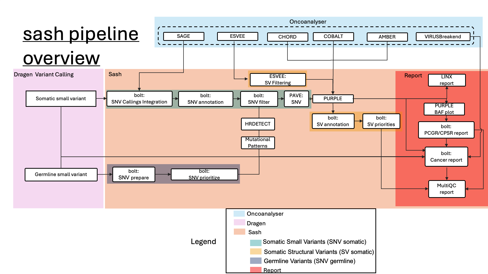

# sash workflow details

## Table of Contents

- [Overview](#overview)
- [HMFtools](#hmftools)
- [Other Tools](#other-tools)
- [Pipeline Inputs](#pipeline-inputs)
- [Reference Exclusions and Blocklists](#reference-exclusions-and-blocklists)
- [Workflows](#workflows)
  - [Somatic Small Variants](#somatic-small-variants)
    - [Variant Calling Re-calling](#variant-calling-re-calling)
    - [Annotation](#annotation)
    - [Filter](#filter)
    - [Reports](#reports)
    - [VCF to MAF conversion](#vcf-to-maf-conversion)
    - [PAVE Driver Catalogue Annotation](#pave-driver-catalogue-annotation)
  - [Somatic Structural Variants](#somatic-structural-variants)
  - [Germline Small Variants](#germline-small-variants)
- [Common Reports](#common-reports)
  - [Cancer Report](#cancer-report)
  - [LINX Report](#linx-report)
  - [MultiQC](#multiqc)
  - [PCGR](#pcgr)
  - [CPSR Report](#cpsr-report)
- [sash Module Outputs](#sash-module-outputs)
- [Coverage](#coverage)
- [Reference Data](#reference-data)
- [FAQ](#faq)
- [Architecture Decision Records](adr.md)

## Overview



The sash Workflow is a genomic analysis framework comprising three primary pipelines:

- Somatic Small Variants (SNV somatic): Detects single nucleotide variants (SNVs) and indels in tumor samples, emphasizing clinical relevance.
- Somatic Structural Variants (SV somatic): Identifies large-scale genomic alterations (deletions, duplications, etc.) and integrates copy number data.
- Germline Variants (SNV germline): Focuses on inherited variants linked to cancer predisposition.

These pipelines utilize Bolt (a Python package designed for modular processing) and leverage outputs from the [DRAGEN](https://sapac.illumina.com/products/by-type/informatics-products/dragen-secondary-analysis.html) Variant Caller alongside the [Hartwig Medical Foundation (HMF) tools](https://github.com/hartwigmedical/hmftools/tree/master) integrated via [Oncoanalyser](https://github.com/nf-core/oncoanalyser). Each pipeline is tailored to a specific type of genomic variant, incorporating filtering, annotation and HTML reports for research and curation.

---

## HMFtools

HMFtools is an open-source suite for cancer genomics developed by the Hartwig Medical Foundation. Key components used in sash include:

- [SAGE (Somatic Alterations in Genome)](https://github.com/hartwigmedical/hmftools/blob/master/sage/README.md):
  A tiered SNV/indel caller targeting cancer hotspots from databases including [Cancer Genome Interpreter](https://www.cancergenomeinterpreter.org/home), [CIViC](http://civic.genome.wustl.edu/), and [OncoKB](https://oncokb.org/) to recover low-frequency variants missed by DRAGEN. Outputs a VCF with confidence tiers (hotspot, panel, high/low confidence).

- [PURPLE](https://github.com/hartwigmedical/hmftools/tree/master/purple):
  Estimates tumor purity (tumor cell fraction) and ploidy (average copy number), integrates copy number data, and calculates TMB (tumor mutation burden) and MSI (microsatellite instability).

- [Cobalt](https://github.com/hartwigmedical/hmftools/blob/master/cobalt/README.md):
  Calculates read-depth ratios from sequencing data, providing essential input for copy number analysis. Its outputs are used by PURPLE to generate accurate copy number profiles across the genome.

- [Amber](https://github.com/hartwigmedical/hmftools/blob/master/amber/README.md):
  Computes B-allele frequencies, which are critical for estimating tumor purity and ploidy. The Amber directory contains these measurements, supporting PURPLE's analysis.

---

## Other Tools

### [SIGRAP](https://github.com/umccr/sigrap)

A framework for running PCGR and other genomic reporting tools.

### [Personal Cancer Genome Reporter (PCGR)](https://github.com/sigven/pcgr/tree/v1.4.1)

Tool for comprehensive clinical interpretation of somatic variants, providing tiered classifications and extensive annotation.

### [Cancer Predisposition Sequencing Report (CPSR)](https://github.com/sigven/cpsr)

Tool for predisposition variant analysis and reporting in germline samples.

### [Genomics Platform Group Reporting (GPGR)](https://github.com/umccr/gpgr)

UMCCR-developed R package for generating cancer genomics reports.

### [Linx](https://github.com/hartwigmedical/hmftools/tree/master/linx)

Tool for structural variant annotation and visualization to classify complex rearrangements.

### [ESVEE](https://github.com/hartwigmedical/hmftools/tree/master/esvee)

Esvee is a structural variant caller optimised for short read sequencing that identifies somatic and germline rearrangements.

### [VIRUSBreakend](https://github.com/PapenfussLab/gridss/blob/master/VIRUSBreakend_Readme.md)

Tool for detecting viral integration events in human genome sequencing data. sash imports the pre-computed VIRUSBreakend directory from oncoanalyser and passes it directly to the cancer report module ([workflows/sash.nf:449](workflows/sash.nf#L449)). The cancer report filters the raw integration calls against `virus_reporting_db` and `virus_taxonomy_db` ([conf/refdata.config:86](conf/refdata.config#L86)) to restrict display to clinically relevant viral species. No re-running of VIRUSBreakend occurs within sash.

---

## Pipeline Inputs

### DRAGEN

- `{tumor_id}.hard-filtered.vcf.gz`: Somatic variant calls from DRAGEN pipeline.
- Optional: `${tumor_id}.hrdscore.csv` homologous recombination deficiency scores (surfaced in the cancer report when present).

### Oncoanalyser

sash expects oncoanalyser v2.2.0+ output directory structure (added in [v0.6.1](https://github.com/umccr/sash/blob/main/CHANGELOG.md)).

#### [ESVEE](https://github.com/hartwigmedical/hmftools/tree/master/esvee)

- `${tumor_id}.esvee.ref_depth.vcf.gz` and the accompanying `esvee/` directory: depth and preparation files used to seed eSVee structural variant calling.

#### [SAGE](https://github.com/hartwigmedical/hmftools/blob/master/sage/README.md)

- `{tumor_id}.sage.somatic.vcf.gz`: Somatic SNV/indel calls from SAGE.

#### [VIRUSBreakend](https://github.com/PapenfussLab/gridss/blob/master/VIRUSBreakend_Readme.md)

- Directory: `virusbreakend/`: Contains outputs from VIRUSBreakend, used for detecting viral integration events.

#### [Cobalt](https://github.com/hartwigmedical/hmftools/blob/master/cobalt/README.md)

- Directory: `cobalt/`: Contains read-depth ratio data required for copy number analysis by PURPLE.

#### [Amber](https://github.com/hartwigmedical/hmftools/blob/master/amber/README.md)

- Directory: `amber/`: Contains B-allele frequency measurements used by PURPLE to estimate tumor purity and ploidy.

---

## Reference Exclusions and Blocklists

Exclusions fall into three tiers by ownership:

**Caller-level** — applied upstream before sash imports any outputs:

- Oncoanalyser REDUX excludes the `unmapped` region class during read processing
- SAGE applies `KnownBlacklist.germline.38.bed` at call time ([sage/README.md#L66](https://github.com/hartwigmedical/hmftools/blob/master/sage/README.md#L66), [pipeline/README_RESOURCES.md#L88](https://github.com/hartwigmedical/hmftools/blob/master/pipeline/README_RESOURCES.md#L88))
- ESVEE prep applies `sv_prep_blacklist.38.bed` to suppress SV calling in excluded regions ([esvee/README.md#L75](https://github.com/hartwigmedical/hmftools/blob/master/esvee/README.md#L75), [pipeline/README_RESOURCES.md#L109](https://github.com/hartwigmedical/hmftools/blob/master/pipeline/README_RESOURCES.md#L109))

**Pipeline-level** — applied by sash to the imported call sets ([bolt/filter.py:67–146](https://github.com/umccr/bolt/blob/v0.2.18/bolt/workflows/smlv_somatic/filter.py#L67)):

- [ENCODE blacklist v2](https://github.com/Boyle-Lab/Blacklist): hard exclusion — all overlapping variants removed unconditionally ([bolt/filter.py:133–137](https://github.com/umccr/bolt/blob/v0.2.18/bolt/workflows/smlv_somatic/filter.py#L133))
- [GIAB genome stratifications](https://github.com/genome-in-a-bottle/genome-stratifications) (difficult regions) — AD ≥ 6 required rather than hard exclusion ([bolt/filter.py:98–117](https://github.com/umccr/bolt/blob/v0.2.18/bolt/workflows/smlv_somatic/filter.py#L98)); tracks used ([bolt/constants.py:100–111](https://github.com/umccr/bolt/blob/v0.2.18/bolt/common/constants.py#L100)):
  - Low-complexity simple repeats: di/tri/quad-TR ≥ 150 bp (`GRCh38_SimpleRepeat_{di,tri,quad}TR_ge150_slop5`)
  - All tandem repeats 201–10000 bp (`GRCh38_AllTandemRepeats_201to10000bp_slop5`)
  - Segmental duplications > 10 kb (`GRCh38_segdups_gt10kb`)
  - Bad promoters (`GRCh38_BadPromoters`)
  - GC extremes: <15% and 70–100% in 5% bands (`GRCh38_gc15`, `GRCh38_gc70to75`, `GRCh38_gc75to80`, `GRCh38_gc80to85`, `GRCh38_gc80`)
  - Non-unique mappability at 100 bp reads, ≤ 2 mismatches (`GRCh38_nonunique_l100_m2_e1`)
- Outside [GIAB high-confidence intervals v4.2.1](https://github.com/genome-in-a-bottle/giab_data_indexes): AD ≥ 6 required ([bolt/filter.py:119–120](https://github.com/umccr/bolt/blob/v0.2.18/bolt/workflows/smlv_somatic/filter.py#L119))
- Panel-of-normal artefacts: PoN count ≥ 5 ([bolt/filter.py:128–131](https://github.com/umccr/bolt/blob/v0.2.18/bolt/workflows/smlv_somatic/filter.py#L128))
- Common population variants: gnomAD AF ≥ 1% ([bolt/filter.py:143–146](https://github.com/umccr/bolt/blob/v0.2.18/bolt/workflows/smlv_somatic/filter.py#L143))

**Reporting-level** — intentional downstream exclusions:

- Restricted virus taxonomy via `virus_reporting_db` and `virus_taxonomy_db` ([conf/refdata.config#L86](conf/refdata.config#L86))

In detail:

1. Caller-level outputs are imported rather than regenerated in sash. [subworkflows/local/prepare_input.nf](/Users/quentinclayssen/github/sash/subworkflows/local/prepare_input.nf#L58) imports precomputed Oncoanalyser outputs, including the SAGE somatic VCF and the ESVEE reference-depth VCF plus prep directory. [workflows/sash.nf](/Users/quentinclayssen/github/sash/workflows/sash.nf#L84) wires those imported assets into the downstream sash workflow, and [modules/local/esvee/call/main.nf](/Users/quentinclayssen/github/sash/modules/local/esvee/call/main.nf#L1) runs ESVEE caller from the imported prep directory, inheriting all caller-level exclusions without re-applying them.

1. HMF caller-level blacklist paths are tracked in sash configuration as upstream provenance ([conf/refdata.config#L70](/Users/quentinclayssen/github/sash/conf/refdata.config#L70), [conf/refdata.config#L80](/Users/quentinclayssen/github/sash/conf/refdata.config#L80)), materialised into the `hmf_data` map by [subworkflows/local/prepare_reference.nf](/Users/quentinclayssen/github/sash/subworkflows/local/prepare_reference.nf#L11). The `sv_prep_blacklist` replaced the former `gridss_region_blocklist` when GRIDSS/GRIPSS was superseded by eSVee in [v0.6.0](https://github.com/umccr/sash/blob/main/CHANGELOG.md#0.6.0---2025-06-04); the GRIDSS blocklist was explicitly removed in [v0.6.1](https://github.com/umccr/sash/blob/main/CHANGELOG.md#0.6.1---2025-09-16).

1. Pipeline-level annotation is performed by bolt's vcfanno step ([bolt/annotate.py:51–61](https://github.com/umccr/bolt/blob/v0.2.18/bolt/workflows/smlv_somatic/annotate.py#L51), [constants.py:97–111](https://github.com/umccr/bolt/blob/v0.2.18/bolt/common/constants.py#L97)) using the `vcfanno_annotations.toml` from the reference annotations directory. ENCODE and all GIAB stratification tracks are flagged as `INFO` fields and then consumed by the filter step. See [Filter](#filter) for exact thresholds.

---

## Workflows

### Somatic Small Variants

#### General

In the Somatic Small Variants workflow, variant detection is performed using the DRAGEN Variant Caller and Oncoanalyser (relying on SAGE and PURPLE outputs). It's structured into four steps: Re-calling, Annotation, Filter, and Report. The final outputs include an HTML report summarizing the results.

#### Summary

1. Re-calling SAGE variants to recover low-frequency mutations in hotspots.
2. Annotate variants with clinical and functional information using PCGR.
3. Filter variants based on quality and frequency criteria, while retaining those of potential clinical significance.
4. Generate comprehensive HTML reports (PCGR, Cancer Report, LINX, MultiQC).

### Variant Calling Re-calling

The variant calling re-calling step uses variants from [SAGE](https://github.com/hartwigmedical/hmftools/tree/master/sage), which is more sensitive than DRAGEN in detecting variants, particularly those with low allele frequency. SAGE focuses on cancer hotspots, prioritizing predefined genomic regions of high clinical or biological relevance with its [filtering system](https://github.com/hartwigmedical/hmftools/tree/master/sage#6-soft-filters). This enables the re-calling of biologically significant variants that may have been missed otherwise.

#### Inputs

- From DRAGEN: Somatic small variant caller VCF
  - `${tumor_id}.main.dragen.vcf.gz`
- From Oncoanalyser: SAGE VCF

  - `${tumor_id}.main.sage.filtered.vcf.gz`

  Filtered on chromosomes 1-22, X, Y, and M.

#### Output

- Re-calling: VCF
  - `${tumor_id}.rescued.vcf.gz`

#### Steps

1. Select High-Confidence SAGE Calls in Hotspot Regions:
   - Filter the SAGE output to retain only variants that pass quality filters and overlap with known hotspot regions.
   - Compare the input VCF and the SAGE VCF to identify overlapping and unique variants.
2. Annotate existing somatic variant calls also present in the SAGE calls in the input VCF:
   - For each variant in the input VCF, check if it exists in the SAGE existing calls.
   - For variants integrated by SAGE:
     - If `SAGE FILTER=PASS` and input VCF `FILTER=PASS`:
       - Set `INFO/SAGE_HOTSPOT` to indicate the variant is called by SAGE in a hotspot.
     - If `SAGE FILTER=PASS` and input VCF `FILTER` is not `PASS`:
       - Set `INFO/SAGE_HOTSPOT` and `INFO/SAGE_RESCUE` to indicate the variant is re-called from SAGE.
       - Update `FILTER=PASS` to include the variant in the final analysis.
     - If `SAGE FILTER` is not `PASS`:
       - Append `SAGE_lowconf` to the `FILTER` field to flag low-confidence variants.
   - Transfer SAGE `FORMAT` fields to the input VCF with a `SAGE_` prefix.
3. Combine annotated input VCF with novel SAGE calls:
   - Prepare novel SAGE calls. For each variant in the SAGE VCF missing from the input VCF:
     - Rename certain `FORMAT` fields in the novel SAGE VCF to avoid namespace collisions:
       - For example, `FORMAT/SB` is renamed to `FORMAT/SAGE_SB`.
     - Retain necessary `INFO` and `FORMAT` annotations while removing others to streamline the data.

### Annotation

The Annotation process employs Reference Sources (GA4GH/GIAB problem region stratifications, GIAB high confidence regions, gnomAD, Hartwig hotspots), UMCCR panel of normals (built from approximately 200 normal samples), and the PCGR tool to enrich variants with [classification](https://sigven.github.io/pcgr/articles/variant_classification.html) and clinical information.
**These annotations are used to decide which variants are retained or filtered in the next step.**

#### Inputs

- Small variant VCF
  - `${tumor_id}.rescued.vcf.gz`

#### Output

- Annotated VCF
  - `${tumor_id}.annotations.vcf.gz`

#### Steps

1. Set FILTER to "PASS" for unfiltered variants:
   - Iterate over the input VCF file and set the `FILTER` field to `PASS` for any variants that currently have no filter status (`FILTER` is `.` or `None`).
2. Annotate the VCF against reference sources ([bolt/annotate.py:51–61](https://github.com/umccr/bolt/blob/v0.2.18/bolt/workflows/smlv_somatic/annotate.py#L51)):
   - Use vcfanno to add annotations to the VCF file:
     - gnomAD (version 2.1) [`INFO/gnomAD_AF`]
     - Hartwig Hotspots [`INFO/HMF_HOTSPOT`]
     - ENCODE Blacklist [`INFO/ENCODE`]
     - Genome in a Bottle High-Confidence Regions (v4.2.1) [`INFO/GIAB_CONF`]
     - GA4GH/GIAB problem region stratifications [`INFO/DIFFICULT_*`]: low-complexity tandem repeats (di/tri/quad and general), GC extremes (<15% and 70–100% in graduated bands), bad promoter, non-unique mappability, segmental duplications
3. Annotate with UMCCR panel of normals counts ([bolt/annotate.py:64–73](https://github.com/umccr/bolt/blob/v0.2.18/bolt/workflows/smlv_somatic/annotate.py#L64)):
   - Use vcfanno and bcftools to annotate the VCF with counts from the UMCCR panel of normals [`INFO/PON_COUNT`].
4. Standardize the VCF fields:
   - Add new `INFO` fields for use with PCGR:
     - `TUMOR_AF`, `NORMAL_AF`: Tumor and normal allele frequencies.
     - `TUMOR_DP`, `NORMAL_DP`: Tumor and normal read depths.
   - Add the `AD` FORMAT field:
     - `AD`: Allelic depths for the reference and alternate alleles.
5. Prepare VCF for PCGR annotation:
   - Make minimal VCF header keeping only INFO AF/DP, and contigs size.
   - Move tumor and normal `FORMAT/AF` and `FORMAT/DP` annotations to the `INFO` field as required by PCGR.
   - Set `FILTER` to `PASS` and remove all `FORMAT` and sample columns.
6. Run PCGR (v1.4.1) to annotate VCF against external sources:
   - Classify variants by tiers based on annotations and functional impact according to AMP/ASCO/CAP guidelines.
   - Add `INFO` fields into the VCF: `TIER`, `SYMBOL`, `CONSEQUENCE`, `MUTATION_HOTSPOT`, `TCGA_PANCANCER_COUNT`, `CLINVAR_CLNSIG`, `ICGC_PCAWG_HITS`, `COSMIC_CNT`.
   - External sources include VEP, ClinVar, COSMIC, TCGA, ICGC, Open Targets Platform, CancerMine, DoCM, CBMDB, DisGeNET, Cancer Hotspots, dbNSFP, UniProt/SwissProt, Pfam, DGIdb, and ChEMBL.
7. Transfer PCGR annotations to the full set of variants:
   - Merge the PCGR annotations back into the original VCF file.
   - Ensure that all variants, including those not selected for PCGR annotation, have relevant clinical annotations where available.
   - Preserve the `FILTER` statuses and other annotations from the original VCF.

### Filter

The Filter step applies a series of stringent filters to somatic variant calls in the VCF file, ensuring the retention of high-confidence and biologically meaningful variants.

#### Inputs

- Annotated VCF
  - `${tumor_id}.annotations.vcf.gz`

#### Output

- Filtered VCF
  - `${tumor_id}*filters_set.vcf.gz`

#### Filters

Variants that do not meet these criteria will be filtered out unless they qualify for [Clinical Significance Exceptions](#clinical-significance-exceptions). Filter logic: [bolt/filter.py:67–146](https://github.com/umccr/bolt/blob/v0.2.18/bolt/workflows/smlv_somatic/filter.py#L67); thresholds: [bolt/constants.py:17–21](https://github.com/umccr/bolt/blob/v0.2.18/bolt/common/constants.py#L17).

| **Filter Type**                            | **Threshold/Criteria**                                                                                                                                                                                              |
| ------------------------------------------ | ------------------------------------------------------------------------------------------------------------------------------------------------------------------------------------------------------------------- |
| **Allele Frequency (AF) Filter**           | Tumor AF < 10% (0.10)                                                                                                                                                                                               |
| **Allele Depth (AD) Filter**               | Fewer than 4 supporting reads                                                                                                                                                                                       |
| **Difficult Region AD Filter**             | AD < 6 in segmental duplications, GC extremes, LCR, bad promoter, or non-unique mappability regions ([bolt/filter.py:98–117](https://github.com/umccr/bolt/blob/v0.2.18/bolt/workflows/smlv_somatic/filter.py#L98)) |
| **Non-GIAB AD Filter**                     | AD < 6 outside GIAB high-confidence regions ([bolt/filter.py:119–120](https://github.com/umccr/bolt/blob/v0.2.18/bolt/workflows/smlv_somatic/filter.py#L119))                                                       |
| **ENCODE Blacklist Filter**                | Hard exclusion for all variants in ENCODE regions ([bolt/filter.py:133–137](https://github.com/umccr/bolt/blob/v0.2.18/bolt/workflows/smlv_somatic/filter.py#L133))                                                 |
| **Population Frequency (gnomAD) Filter**   | gnomAD AF ≥ 1% (0.01)                                                                                                                                                                                               |
| **Panel of Normals (PoN) Germline Filter** | Present in ≥ 5 normal samples                                                                                                                                                                                       |

#### Clinical Significance Exceptions

Rescue logic: [bolt/filter.py:152–220](https://github.com/umccr/bolt/blob/v0.2.18/bolt/workflows/smlv_somatic/filter.py#L152); rescue thresholds: [bolt/constants.py:29–41](https://github.com/umccr/bolt/blob/v0.2.18/bolt/common/constants.py#L29).

| Exception Category               | Criteria                                                                                                                                 |
| -------------------------------- | ---------------------------------------------------------------------------------------------------------------------------------------- |
| **Reference Database Hit Count** | COSMIC count ≥10 OR TCGA pan-cancer count ≥5 OR ICGC PCAWG count ≥5                                                                      |
| **ClinVar Pathogenicity**        | ClinVar classification of `conflicting_interpretations_of_pathogenicity`, `likely_pathogenic`, `pathogenic`, or `uncertain_significance` |
| **Mutation Hotspots**            | Annotated as `HMF_HOTSPOT`, `PCGR_MUTATION_HOTSPOT`, or SAGE Hotspots (CGI, CIViC, OncoKB)                                               |
| **PCGR Tier Exception**          | Classified as `TIER_1` OR `TIER_2`                                                                                                       |

### Reports

The Report step utilizes the Personal Cancer Genome Reporter (PCGR) and other tools to generate comprehensive reports.

#### Inputs

- Purple purity data
- Filtered VCF
  - `${tumor_id}*filters_set.vcf.gz`
- DRAGEN VCF
  - `${tumor_id}.main.dragen.vcf.gz`

#### Output

- PCGR Cancer report
  - `${tumor_id}.pcgr.grch38.html`

#### Steps

1. Generate BCFtools Statistics on the Input VCF:
   - Run `bcftools stats` to gather statistics on variant quality and distribution.
2. Calculate Allele Frequency Distributions:
   - Filter and normalize variants according to high-confidence regions.
   - Extract allele frequency data from tumor samples.
   - Produce both a global allele frequency summary and a subset of allele frequencies restricted to key cancer genes.
3. Compare Variant Counts From Two Variant Sets (DRAGEN vs. BOLT):
   - Count the total number and types of variants (SNPs, Indels, Others) passing filters in both the DRAGEN VCF and the Filtered BOLT VCF.
4. Count Variants by Processing Stage.
5. Parse Purity and Ploidy Information (Purple Data).
6. Run PCGR (GRCh38 VEP 113 / `pcgr_ref_data.20250314`) to generate the final report. For samples exceeding PCGR's 500,000-variant limit, bolt progressively reduces the input before this step — see [ADR #1](adr.md).

### VCF to MAF conversion

After filtering, the pipeline converts the somatic VCF to MAF using `vcf2maf` (v1.6.22) for downstream tools that expect MAF format.

#### Output

- MAF file for the tumour/normal pair
  - `${tumor_id}.maf`

### PAVE Driver Catalogue Annotation

PAVE (v1.8, [modules/local/pave/somatic/main.nf](modules/local/pave/somatic/main.nf)) runs on the bolt-filtered VCF to produce functional variant annotations required for the PURPLE driver catalogue. It is not part of the primary clinical filtering chain — its output feeds `PURPLE_CALLING` ([workflows/sash.nf:251](workflows/sash.nf#L251)) rather than the cancer report.

Before running PAVE, MNV-component variants are excluded:

```sh
bcftools view --exclude 'INFO/MNVTAG!="."' ... ${vcf}
```

This prevents PAVE from double-annotating individual base substitutions that are already represented as a combined MNV record. Added in [v0.6.1](https://github.com/umccr/sash/blob/main/CHANGELOG.md).

PAVE is run with `-write_pass_only` and annotates against ClinVar, gnomAD, mappability, Ensembl data resources, and the HMF driver gene panel. The resulting VCF is consumed exclusively by PURPLE for its somatic driver catalogue; it is not published as a standalone output.

### Somatic Structural Variants

The Somatic Structural Variants (SVs) pipeline identifies and annotates large-scale genomic alterations, including deletions, duplications, inversions, insertions, and translocations in tumor samples. Calls now come from eSVee (replacing GRIDSS/GRIPSS), but the downstream PURPLE/SnpEff/prioritisation steps remain unchanged.

#### Summary

1. eSVee filtering:
   - Refines the structural variant calls using read counts, panel-of-normals, known fusion hotspots, and repeat masker annotations.
2. PURPLE:
   - Combines the eSVee-filtered SV calls with copy number variation (CNV) data and tumor purity/ploidy estimates.
3. Annotation:
   - Combines SV calls with CNV data and annotates using [SnpEff](https://github.com/pcingola/SnpEff).
4. Prioritization:
   - Prioritizes SV annotations based on [AstraZeneca-NGS](https://github.com/AstraZeneca-NGS/simple_sv_annotation) using curated reference data.
5. Report:
   - Generates cancer report and MultiQC output.

#### Inputs

- eSVee (GRIDSS/GRIPSS replacement)
  - `${tumor_id}.esvee.somatic.vcf.gz`

#### Steps

1. eSVee filtering:
   - Evaluate split-read and paired-end support; discard variants with low support.
   - Apply panel-of-normals filtering to remove artifacts observed in normal samples.
   - Retain variants overlapping known oncogenic fusion hotspots (using UMCCR-curated lists).
   - Exclude variants in repetitive regions based on Repeat Masker annotations.
2. PURPLE:
   - Merge SV calls with CNV segmentation data.
   - Estimate tumor purity and ploidy.
   - Adjust SV breakpoints based on copy number transitions.
   - Classify SVs as somatic or germline.
3. Annotation:
   - Compile SV and CNV information into a unified VCF file.
   - Extend the VCF header with PURPLE-related INFO fields (e.g., PURPLE_baf, PURPLE_copyNumber).
   - Convert CNV records from TSV format into VCF records with appropriate SVTYPE tags (e.g., 'DUP' for duplications, 'DEL' for deletions).
   - Run SnpEff to annotate the unified VCF with functional information such as gene names, transcript effects, and coding consequences.
4. Prioritization:
   - Run the prioritization module (forked from the AstraZeneca simple_sv_annotation tool) using reference data files including known fusion pairs, known fusion 5′ and 3′ lists, key genes, and key tumor suppressor genes.
   - Classify Variants:
     - Structural Variants (SVs): Variants labeled with the source `sv_esvee`.
     - Copy Number Variants (CNVs): Variants labeled with the source `cnv_purple`.
5. Prioritize variants on a 4-tier system using [prioritize_sv](https://github.com/umccr/vcf_stuff/blob/master/scripts/prioritize_sv.):
   - **1 (high)** - **2 (moderate)** - **3 (low)** - **4 (no interest)**
   - Exon loss:
     - On cancer gene list (1)
     - Other (2)
   - Gene fusion:
     - Paired (hits two genes):
       - On list of known pairs (1) (curated by [HMF](https://resources.hartwigmedicalfoundation.nl))
       - One gene is a known promiscuous fusion gene (1) (curated by [HMF](https://resources.hartwigmedicalfoundation.nl))
       - On list of [FusionCatcher](https://github.com/ndaniel/fusioncatcher/blob/master/bin/generate_known.py) known pairs (2)
       - Other:
         - One or two genes on cancer gene list (2)
         - Neither gene on cancer gene list (3)
     - Unpaired (hits one gene):
       - On cancer gene list (2)
       - Others (3)
   - Upstream or downstream: A specific type of fusion where one gene comes under the control of another gene's promoter, potentially leading to overexpression (oncogene) or underexpression (tumor suppressor gene):
     - On cancer gene list genes (2)
   - LoF or HIGH impact in a tumor suppressor:
     - On cancer gene list (2)
     - Other TS gene (3)
   - Other (4)
6. Filter Low-Quality Calls:
   - Apply Quality Filters:
     - Keep variants with sufficient read support (e.g., split fragments (SF) ≥ 5 and discordant fragments (DF) ≥ 5).
     - Exclude Tier 3 and Tier 4 variants where `SF < 5` and `DF < 5`.
     - Exclude Tier 3 and Tier 4 variants where `SF < 10`, `DF < 10`, and allele frequencies (`AF0` or `AF1`) are below 0.1.
   - Note: SF (Split Fragments) and DF (Discordant Fragments) replaced the former SR (Split Read) and PR (Paired-Read) metric names when eSVee replaced GRIDSS/GRIPSS in [v0.6.0](https://github.com/umccr/sash/blob/main/CHANGELOG.md).
7. Report:
   - Generate MultiQC and cancer report outputs.

### Germline Small Variants

Filtering Select passing variants in the given [gene panel transcript regions](https://github.com/umccr/gene_panels/tree/main/germline_panel) made with PMCC familial cancer clinic list then make CPSR report.

#### Inputs

- DRAGEN VCF
  - `${normal_id}.hard-filtered.vcf.gz`

#### Output

- CPSR report
  - `${normal_id}.cpsr.grch38.html`

#### Steps

1. Prepare:
   - Selection of Passing Variants:
     - Raw germline variant calls from DRAGEN are filtered to retain only those variants marked as PASS (or with no filter flag).
   - Selection of Gene Panel Variants:
     - The filtered variants are further restricted to regions defined by the [gene panel transcript regions file](https://github.com/umccr/gene_panels/tree/main/germline_panel), based on the PMCC familial cancer clinic list.
2. Report:
   - Generate CPSR (Cancer Predisposition Sequencing Report) summarizing germline findings.

---

## Common Reports

### [Cancer Report](https://umccr.github.io/gpgr/)

UMCCR cancer report containing:

#### Tumor Mutation Burden (TMB)

- Data Source: filtered somatic VCF
- Tool: PURPLE

#### Mutational Signatures

- Data Source: filtered somatic SNV VCF (Sigrap MutationalPatterns output)
- Tool: Sigrap (MutationalPatterns wrapper)

#### Contamination Score

- Data Source: –
- Note: No dedicated contamination metric is currently generated

#### Purity & Ploidy

- Data Source: COBALT (providing read-depth ratios) and AMBER (providing B-allele frequency measurements)
- Tool: PURPLE, which uses these inputs to compute sample purity (percentage of tumor cells) and overall ploidy (average copy number)

#### HRD Score

- Data Source: optional DRAGEN HRD score (`${tumor_id}.hrdscore.csv`), Sigrap HRDetect JSON, and oncoanalyser CHORD predictions
- Tool: DRAGEN HRD, Sigrap HRDetect, and CHORD

#### MSI (Microsatellite Instability)

- Data Source: SAGE-specific tags within the somatic VCF passed to PURPLE
- Tool: PURPLE (from v4.1, MSI calculation relies on SAGE-specific tags rather than raw indel counts — changed in [v0.6.0](https://github.com/umccr/sash/blob/main/CHANGELOG.md))

#### Structural Variant Metrics

- Data Source: eSVee SV VCF and PURPLE CNV segmentation
- Tools: eSVee, PURPLE, and the AstraZeneca simple_sv_annotation prioritisation rules

#### Copy Number Metrics (Segments, Deleted Genes, etc.)

- Data Source: PURPLE CNV outputs (segmentation files, gene-level CNV TSV)
- Tool: PURPLE

### LINX Report

LINX annotates and visualises structural variants, classifying complex rearrangements and predicting gene fusions. The report includes:

- Tables of Variants:
  - Breakends
  - Links
  - Driver Catalog
- Plots:
  - Cluster-Level Plots

### MultiQC

General Stats: Overview of QC metrics aggregated from all tools, providing high-level sample quality information.

DRAGEN: Mapping metrics (mapped reads, paired reads, duplicated alignments, secondary alignments), WGS coverage (average depth, cumulative coverage, per-contig coverage), fragment length distributions, trimming metrics, and time metrics for pipeline steps.

PURPLE: Sample QC status (PASS/FAIL), ploidy, tumor purity, polyclonality percentage, tumor mutational burden (TMB), microsatellite instability (MSI) status, and variant metrics for somatic and germline SNPs/indels.

BcfTools Stats: Variant substitution types, SNP and indel counts, quality scores, variant depth, and allele frequency metrics for both somatic and germline variants.

DRAGEN-FastQC: Per-base sequence quality, per-sequence quality scores, GC content (per-sequence and per-position), HRD score, sequence length distributions, adapter contamination, and sequence duplication levels.

### PCGR

Personal Cancer Genome Reporter (PCGR) tool generates a comprehensive, interactive HTML report that consolidates filtered and annotated variant data, providing detailed insights into the somatic variants identified.

Key Metrics:

- Variant Classification and Tier Distribution: PCGR categorizes variants into tiers based on their clinical and biological significance. The report details the proportion of variants across different tiers, indicating their potential clinical relevance.
- Mutational Signatures: The report includes analysis of mutational signatures, offering insights into the mutational processes active in the tumor.
- Copy Number Alterations (CNAs): Visual representations of CNAs are provided, highlighting significant gains and losses across the genome. Genome-wide plots display regions of copy number gains and losses.
- Tumor Mutational Burden (TMB): Calculations of TMB are included, which can have implications for immunotherapy eligibility. The report presents the TMB value, representing the number of mutations per megabase.
- Microsatellite Instability (MSI) Status: Assessment of MSI status is performed, relevant for certain cancer types and treatment decisions.
- Clinical Trials Information: Information on relevant clinical trials is incorporated, offering potential therapeutic options based on the identified variants.

Note: The PCGR tool is designed to process a maximum of 500,000 variants. If the input VCF file contains more than this limit, variants exceeding 500,000 will be filtered out.

### CPSR Report

The CPSR (Cancer Predisposition Sequencing Report) includes the following:

Settings:

- Sample metadata
- Report configuration
- Virtual gene panel

Summary of Findings:

- Variant statistics

Variant Classification:

ClinVar and Non-ClinVar variants:

- Class 5 - Pathogenic variants
- Class 4 - Likely Pathogenic variants
- Class 3 - Variants of Uncertain Significance (VUS)
- Class 2 - Likely Benign variants
- Class 1 - Benign variants
- Biomarkers

PCGR TIER according to [ACMG](https://www.ncbi.nlm.nih.gov/pubmed/27993330):

- Tier 1 (High): Highest priority variants with strong clinical relevance.
- Tier 2 (Moderate): Variants with potential clinical significance.
- Tier 3 (Low): Variants with uncertain significance.
- Tier 4 (No Interest): Variants unlikely to be clinically relevant.

---

## Coverage

Coverage analysis in sash relies entirely on the metrics produced by DRAGEN during upstream sequencing and surfaced through MultiQC. No dedicated per-base depth tool (e.g. mosdepth, goleft, CACAO) runs within sash; CACAO was removed in a prior release (see [FAQ](#q-we-dropped-the-cacao-coverage-reports-can-we-discuss-how-to-utilize-dragen-or-hmftools-coverage-information-instead)).

The DRAGEN WGS coverage metrics visible in the MultiQC report include:

- Mean depth across the genome
- Cumulative coverage curves (percentage of bases covered at each depth threshold)
- Per-contig depth breakdown
- Fragment length distributions

These are populated from the DRAGEN mapping and coverage summary files ingested by MultiQC as part of the `Common Reports` step. HMFtools coverage integration is planned for a future release.

---

## Reference Data

### [UMCCR Gene Panels](https://github.com/umccr/gene_panels)

#### Somatic cancer gene panel

`umccr_cancer_genes.tsv` (v24.03.0, [gene_panels/somatic_panel](https://github.com/umccr/gene_panels/tree/main/somatic_panel)) classifies genes as tumor suppressors and/or oncogenes. It is used across multiple sash steps:

- **SV prioritisation**: genes on this list raise a variant's priority tier in the `simple_sv_annotation` step ([Somatic Structural Variants → Prioritization](#somatic-structural-variants))
- **Somatic small variant annotation**: the gene region BED (`umccr_cancer_genes.gene_regions.bed`) and CDS region BED are passed to `bolt smlv_somatic annotate` and `bolt smlv_somatic report` ([modules/local/bolt/smlv_somatic/annotate/main.nf](modules/local/bolt/smlv_somatic/annotate/main.nf), [modules/local/bolt/smlv_somatic/report/main.nf](modules/local/bolt/smlv_somatic/report/main.nf))
- **Hypermutated sample handling**: when variant counts exceed 500,000, variants lacking clinical impact or hotspot annotations are filtered until the threshold is met; the cancer gene list defines what "clinical impact" means in this context

In [v0.6.4](https://github.com/umccr/sash/blob/main/CHANGELOG.md), the CDKN2A MANE Plus Clinical transcript `ENST00000579755` was added, fixing a gap in CDKN2A CDS coverage.

#### Germline predisposition panel

`umccr_predisposition_genes` ([gene_panels/germline_panel](https://github.com/umccr/gene_panels/tree/main/germline_panel)) is compiled from the PMCC familial cancer clinic list. The transcript region BED (`umccr_predisposition_genes.transcript_regions.bed`) restricts germline variant analysis to transcripts of clinically relevant predisposition genes before CPSR reporting ([Germline Small Variants → Prepare](#germline-small-variants)).

### Genome Annotations

#### HMFtools Reference Data

- Ensembl reference data (GRCh38)
- Somatic driver catalogs
- Known fusion gene pairs
- Driver gene panels

#### Annotation Databases:

- gnomAD (v2.1): Provides population allele frequencies to help distinguish common variants from rare ones.
- ClinVar (20220103): Offers clinically curated variant information, aiding in the interpretation of potential pathogenicity.
- COSMIC: Contains data on somatic mutations found in cancer, facilitating the identification of cancer-related variants.
- Gene Panels: Focuses analysis on specific sets of genes relevant to particular conditions or research interests.

#### Structural Variant Data:

- SnpEff Databases: Used for predicting the effects of variants on genes and proteins.
- Panel of Normals (PON): Helps filter out technical artifacts by comparing against a set of normal samples.
- RepeatMasker: Identifies repetitive genomic regions to prevent false-positive variant calls.

Databases/datasets PCGR Reference Data:

- Version: [`pcgr_ref_data.20250314.grch38.tgz`](https://github.com/sigven/pcgr/releases) with GRCh38 VEP 113 cache (`homo_sapiens_vep_113_GRCh38.tar.gz`). Both archives are auto-extracted by the `PREPARE_REFERENCE` subworkflow.
- Contents include refreshed ClinVar, COSMIC, dbNSFP, gnomAD, OncoKB/CGI biomarker sets, and PCGR/CPSR configuration files aligned with PCGR v2.x.

---

## sash Module Outputs

### Somatic SNVs

- File: `smlv_somatic/filter/{tumor_id}.pass.vcf.gz`
- Description: Contains somatic single nucleotide variants (SNVs) with filtering applied (VCF format).

### Somatic SVs

- File: `sv_somatic/prioritise/{tumor_id}.sv.prioritised.vcf.gz`
- Description: Contains somatic structural variants (SVs) with prioritization applied (VCF format).

### Somatic CNVs

- File: `cancer_report/cancer_report_tables/purple/{tumor_id}-purple_cnv_som.tsv.gz`
- Description: Contains somatic copy number variations (CNVs) data (TSV format).

### Somatic Gene CNVs

- File: `cancer_report/cancer_report_tables/purple/{tumor_id}-purple_cnv_som_gene.tsv.gz`
- Description: Contains gene-level somatic copy number variations (CNVs) data (TSV format).

### Germline SNVs

- File: `dragen_germline_output/{normal_id}.hard-filtered.vcf.gz`
- Description: Contains germline single nucleotide variants (SNVs) with hard filtering applied (VCF format).

### Purple Purity, Ploidy, MS Status

- File: `purple/{tumor_id}.purple.purity.tsv`
- Description: Contains estimated tumor purity, ploidy, and microsatellite status (TSV format).

### PCGR JSON with TMB

- File: `smlv_somatic/report/pcgr/{tumor_id}.pcgr.grch38.json.gz`
- Description: Contains PCGR annotations, including tumor mutational burden (TMB) (JSON format).

### DRAGEN HRD Score (input)

- File: `${tumor_id}.hrdscore.csv` (from `dragen_somatic_dir`)
- Description: Optional DRAGEN homologous recombination deficiency (HRD) score propagated into the cancer report when provided.

### Sigrap HRDetect

- File: `sigrap/hrdetect/hrdetect.json.gz`
- Description: HRDetect JSON summarising HRD probability from combined SNV/SV/CNV signals.

### Sigrap MutationalPatterns

- Directory: `sigrap/mutpat/`
- Description: Mutational signature TSVs/plots (SBS/DBS/indels) generated by Sigrap’s MutationalPatterns wrapper.

### Somatic MAF export

- File: `vcf2maf/{tumor_id}.maf`
- Description: MAF representation of the filtered somatic VCF for downstream tools that prefer MAF input.

---

## FAQ

### Q: Do we use PCGR for the rescue of SAGE?

A: Rescue is performed by BOLT using SAGE hotspot calls layered onto the DRAGEN VCF. PCGR is only used later for reporting/annotation; it does not drive the rescue step.

### Q: How are hypermutated samples handled in the current version, and is there any impact on derived metrics such as TMB or MSI?

A: When the post-filter variant count exceeds PCGR's 500,000-variant limit, bolt progressively reduces the variant set before passing it to PCGR. The published filtered VCF and PURPLE-derived TMB/MSI are unaffected. See [ADR #1](adr.md) for the full rationale, implementation details, and history of the cancer report hypermutated flag revert.

### Q: How are we handling non-standard chromosomes if present in the input VCFs (ALTs, chrM, etc)?

A: We filter on chromosomes 1-22 and chromosomes X, Y, M. All other non-standard chromosomes and contigs are filtered out.

### Q: What inputs for the cancer reporter - have they changed (and what can we harmonize); e.g., where is the Circos plot from at this point?

A: Circos plots are generated by PURPLE.

### Q: We dropped the CACAO coverage reports. Can we discuss how to utilize DRAGEN or HMFtools coverage information instead?

A: DRAGEN coverage metrics are now integrated into the MultiQC report, providing a comprehensive overview of sequencing quality and coverage across the genome. We are exploring further integration of HMFtools coverage analysis for future releases.

### Q: What TMB score is displayed in the cancer reporter?

A: The cancer report surfaces the PURPLE-derived TMB; the PCGR HTML also reports its own TMB estimate for comparison.

### Q: What filtered VCF is the source for the mutational signatures?

A: Sigrap MutationalPatterns uses the filtered somatic VCF (post-rescue and filtering); its outputs are published under `sigrap/mutpat/` and fed into the cancer report.

### Q: Where is the contamination score coming from currently?

A: Currently, sash does not calculate a dedicated contamination metric. Tumor purity estimation from PURPLE serves as the primary indicator of sample quality.

### Q: Do the SV steps do something more than what's happening in Oncoanalyser?

A: SASH reuses the WiGiTS export to re-run eSVee with UMCCR reference data and panel-of-normals, then applies PURPLE, SnpEff and simple_sv_annotation. GRIDSS/GRIPSS are no longer used.

### Q: Does the data from Somatic Small Variants workflow get used for the SV analysis?

A: No, the somatic small variant workflow data is not used in the structural variant (SV) workflow. These are independent analyses that run in parallel.

### Q: Is Kataegis detection included in sash?

A: No. The Kataegis module was removed in [v0.6.0](https://github.com/umccr/sash/blob/main/CHANGELOG.md) and is no longer part of the pipeline.
